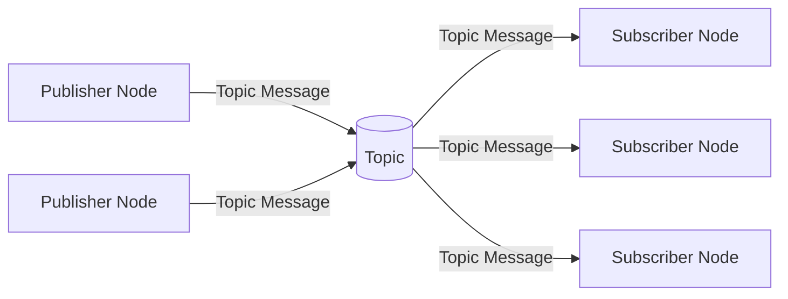

import ChapterControls from '@site/src/components/ChapterControls';

<ChapterControls 
  chapterContent={`
    # Your chapter content here
    
    This is the text that will be personalized and translated.
  `}
  userBackground={
    typeof window !== 'undefined' 
      ? JSON.parse(localStorage.getItem('user') || '{}') 
      : {}
  }
/>

<!-- Rest of your chapter content -->

---
sidebar_position: 3
---

# 🤖 Nodes and Topics - The ROS 2 Communication Foundation

In ROS 2, nodes and topics form the backbone of robotic communication. Nodes are the fundamental computational units that perform specific tasks, while topics enable asynchronous, decoupled communication between them. Understanding this publish-subscribe pattern is crucial for building robust robotic systems that can scale from simple single-robot applications to complex multi-robot coordination systems.

## 🎯 Learning Objectives

By the end of this chapter, you will:
- Understand the fundamental concepts of ROS 2 nodes and topics
- Create publisher and subscriber nodes using Python and rclpy
- Design custom message types for your robotic applications
- Implement Quality of Service (QoS) policies for reliable communication
- Build a complete node-to-node communication system

## 🌐 Understanding Nodes and Topics

ROS 2 nodes are independent processes that perform specific computational tasks. Think of them as microservices in a distributed system - each node has a specific responsibility and communicates with other nodes through standardized interfaces called topics, services, and actions.

A **topic** is a named channel that allows nodes to publish data to and subscribe from. This publish-subscribe pattern creates loose coupling between nodes: publishers don't need to know who's listening, and subscribers don't need to know who's sending data. This architecture makes ROS 2 systems highly modular and scalable.

:::tip Pro Tip
Nodes can be both publishers and subscribers simultaneously, allowing them to act as communication bridges between different parts of your robotic system.
:::

### The Publisher-Subscriber Pattern

In the publisher-subscriber model, data flows in one direction from publishers to subscribers:



This pattern offers several advantages:
- **Decoupling**: Publishers and subscribers don't need to know about each other
- **Scalability**: Multiple subscribers can listen to the same topic
- **Asynchrony**: Publishers and subscribers can run at different rates
- **Robustness**: Failure of one node doesn't necessarily affect others

## 🛠️ Creating Your First Publisher Node

Let's start by creating a simple publisher node that publishes sensor data. This will demonstrate the basic structure of a ROS 2 node using Python's rclpy library.

First, create a Python file for your publisher node:

```python
# sensor_publisher.py
import rclpy
from rclpy.node import Node
from std_msgs.msg import String
import time

class SensorPublisher(Node):
    def __init__(self):
        super().__init__('sensor_publisher')

        # Create a publisher with String message type
        self.publisher_ = self.create_publisher(String, 'sensor_data', 10)

        # Create a timer to publish data every 0.5 seconds
        timer_period = 0.5  # seconds
        self.timer = self.create_timer(timer_period, self.timer_callback)

        # Counter to track published messages
        self.i = 0

        self.get_logger().info('Sensor Publisher Node Started')

    def timer_callback(self):
        msg = String()
        msg.data = f'Sensor reading: {self.i}'
        self.publisher_.publish(msg)
        self.get_logger().info(f'Publishing: "{msg.data}"')
        self.i += 1

def main(args=None):
    rclpy.init(args=args)

    sensor_publisher = SensorPublisher()

    try:
        rclpy.spin(sensor_publisher)
    except KeyboardInterrupt:
        pass
    finally:
        sensor_publisher.destroy_node()
        rclpy.shutdown()

if __name__ == '__main__':
    main()
```

Let's break down the key components:

1. **Node Inheritance**: Your class inherits from `Node` to become a ROS 2 node
2. **Publisher Creation**: `create_publisher()` creates a publisher for the topic
3. **Timer Callback**: Creates a timed callback to publish data at regular intervals
4. **Message Publishing**: The callback creates a message and publishes it to the topic

### Quality of Service (QoS) Policies

ROS 2 provides Quality of Service (QoS) policies to control how messages are delivered. These policies determine reliability, durability, and history of message delivery:

```python
from rclpy.qos import QoSProfile, ReliabilityPolicy, HistoryPolicy

# Create a custom QoS profile
qos_profile = QoSProfile(
    depth=10,  # Keep 10 messages in history
    reliability=ReliabilityPolicy.RELIABLE,  # Ensure delivery
    history=HistoryPolicy.KEEP_LAST  # Keep only the last N messages
)

# Use the custom QoS profile
self.publisher_ = self.create_publisher(String, 'sensor_data', qos_profile)
```

Different QoS policies are useful for different scenarios:
- **Reliable**: For critical data where no messages can be lost
- **Best Effort**: For high-frequency data where some loss is acceptable
- **Keep Last**: For state updates where only the most recent value matters
- **Keep All**: For logging where every message is important

## 📬 Creating Your First Subscriber Node

Now let's create a subscriber node that listens to the sensor data published by our publisher:

```python
# sensor_subscriber.py
import rclpy
from rclpy.node import Node
from std_msgs.msg import String

class SensorSubscriber(Node):
    def __init__(self):
        super().__init__('sensor_subscriber')

        # Create a subscription to the 'sensor_data' topic
        self.subscription = self.create_subscription(
            String,
            'sensor_data',
            self.listener_callback,
            10)  # QoS depth parameter

        # Prevent unused variable warning
        self.subscription  # type: ignore

        self.get_logger().info('Sensor Subscriber Node Started')

    def listener_callback(self, msg):
        self.get_logger().info(f'I heard: "{msg.data}"')

def main(args=None):
    rclpy.init(args=args)

    sensor_subscriber = SensorSubscriber()

    try:
        rclpy.spin(sensor_subscriber)
    except KeyboardInterrupt:
        pass
    finally:
        sensor_subscriber.destroy_node()
        rclpy.shutdown()

if __name__ == '__main__':
    main()
```

The subscriber follows a similar pattern:
1. **Subscription Creation**: `create_subscription()` creates a subscription to a topic
2. **Callback Function**: Called whenever a message arrives on the topic
3. **Message Processing**: The callback processes the received message

## 🧱 Designing Custom Message Types

While `std_msgs` provides basic message types, real robotics applications often require custom data structures. Let's create a custom message type for sensor data that includes timestamp, sensor ID, and reading value.

First, create a message definition file:

```text
# Create msg/SensorReading.msg
# Custom sensor reading message
int32 sensor_id
float64 value
builtin_interfaces.msg.Time timestamp
string sensor_type
```

To use this custom message in Python:

```python
# custom_sensor_publisher.py
import rclpy
from rclpy.node import Node
from builtin_interfaces.msg import Time
from my_robot_msgs.msg import SensorReading  # Your custom message
import time

class CustomSensorPublisher(Node):
    def __init__(self):
        super().__init__('custom_sensor_publisher')

        # Create publisher for custom message
        self.publisher_ = self.create_publisher(SensorReading, 'custom_sensor_data', 10)

        timer_period = 1.0
        self.timer = self.create_timer(timer_period, self.timer_callback)
        self.i = 0

    def timer_callback(self):
        msg = SensorReading()
        msg.sensor_id = 1
        msg.value = 42.5 + self.i
        msg.sensor_type = 'temperature'

        # Get current time
        current_time = self.get_clock().now().to_msg()
        msg.timestamp = current_time

        self.publisher_.publish(msg)
        self.get_logger().info(f'Published sensor {msg.sensor_id} reading: {msg.value}')
        self.i += 1

def main(args=None):
    rclpy.init(args=args)
    node = CustomSensorPublisher()

    try:
        rclpy.spin(node)
    except KeyboardInterrupt:
        pass
    finally:
        node.destroy_node()
        rclpy.shutdown()

if __name__ == '__main__':
    main()
```

### Creating a Complete Package Structure

For a complete ROS 2 package with custom messages, you'll need this directory structure:

```
my_robot_package/
├── CMakeLists.txt
├── package.xml
├── setup.py
├── setup.cfg
├── resource/
│   └── my_robot_package
├── my_robot_package/
│   ├── __init__.py
│   └── nodes/
│       ├── sensor_publisher.py
│       └── sensor_subscriber.py
├── msg/
│   └── SensorReading.msg
└── launch/
    └── sensor_nodes.launch.py
```

## 🔧 Advanced Publisher-Subscriber Patterns

### Multiple Publishers and Subscribers

ROS 2 supports multiple publishers and subscribers on the same topic, enabling complex communication patterns:

```python
# multi_publisher.py
import rclpy
from rclpy.node import Node
from std_msgs.msg import String

class MultiPublisher(Node):
    def __init__(self, publisher_id):
        super().__init__(f'multi_publisher_{publisher_id}')

        self.publisher_id = publisher_id
        self.publisher_ = self.create_publisher(String, 'multi_topic', 10)

        timer_period = 2.0
        self.timer = self.create_timer(timer_period, self.timer_callback)

        self.get_logger().info(f'Multi Publisher {publisher_id} Started')

    def timer_callback(self):
        msg = String()
        msg.data = f'Message from publisher {self.publisher_id}'
        self.publisher_.publish(msg)
        self.get_logger().info(f'Publisher {self.publisher_id}: {msg.data}')

# multi_subscriber.py
class MultiSubscriber(Node):
    def __init__(self):
        super().__init__('multi_subscriber')
        self.subscription = self.create_subscription(
            String,
            'multi_topic',
            self.listener_callback,
            10)
        self.subscription  # type: ignore
        self.get_logger().info('Multi Subscriber Started')

    def listener_callback(self, msg):
        self.get_logger().info(f'Multi Subscriber received: "{msg.data}"')
```

### Latching Topics

Sometimes you want late-joining subscribers to receive the most recent message immediately. This is called "latching":

```python
from rclpy.qos import QoSPresetProfiles

# Publisher with latching behavior
qos_profile = QoSPresetProfiles.TRANSIENT_LOCAL.value
self.publisher_ = self.create_publisher(String, 'latched_topic', qos_profile)
```

## 🧪 Hands-On Exercise: Temperature Monitoring System

Create a temperature monitoring system with the following requirements:

**Expected Time:** 25 minutes

**Requirements:**
- Temperature publisher that simulates sensor readings
- Temperature subscriber that logs readings and detects anomalies
- Custom message type for temperature data

**Instructions:**
1. Create a custom message type for temperature readings with sensor ID, temperature value, and timestamp
2. Implement a temperature publisher that publishes simulated temperature readings (use random values around 20-30°C)
3. Implement a temperature subscriber that logs readings and alerts when temperature exceeds 25°C
4. Test the system by running both nodes simultaneously

**Solution Hints:**
- Use Python's `random.uniform()` for simulating temperature readings
- Remember to import the necessary message types
- Consider using QoS policies appropriate for sensor data

## 💡 Key Takeaways

- **Nodes** are independent processes that perform specific tasks in ROS 2
- **Topics** enable asynchronous, decoupled communication through publish-subscribe patterns
- **Quality of Service (QoS)** policies control message delivery characteristics
- **Custom messages** allow you to define application-specific data structures
- The publisher-subscriber pattern promotes modularity and scalability in robotic systems

## 📚 Further Reading

- [ROS 2 Documentation - Nodes and Topics](https://docs.ros.org/en/rolling/Concepts/About-Topics.html)
- [ROS 2 Quality of Service](https://docs.ros.org/en/rolling/Concepts/About-Quality-of-Service.html)
- [Creating Custom Message Types](https://docs.ros.org/en/rolling/Tutorials/Creating-Your-First-ROS2-Package.html)

---

**Next Chapter:** [Services and Actions](/module-1/services-and-actions)
