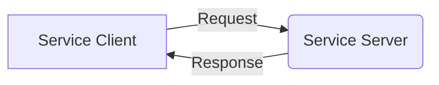
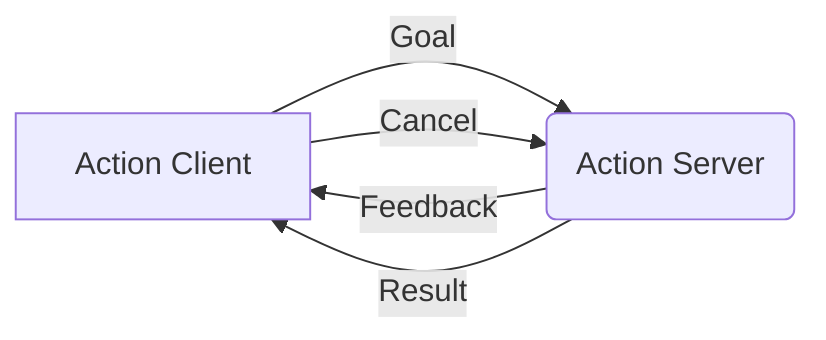

# ⚡ Services and Actions - Synchronous Communication in ROS 2

While topics enable asynchronous communication between ROS 2 nodes, sometimes you need synchronous request-reply interactions or long-running tasks with feedback. This is where **services** and **actions** come into play. Services provide request-reply communication similar to REST APIs, while actions offer a more sophisticated approach for long-running tasks with progress feedback and the ability to cancel operations.

## 🎯 Learning Objectives

By the end of this chapter, you will:
- Understand the differences between topics, services, and actions
- Create service servers and clients using Python and rclpy
- Implement actions for long-running tasks with feedback
- Design appropriate communication patterns for different use cases
- Build a complete service-based navigation system

## 🔄 Understanding Services vs Actions vs Topics

ROS 2 provides three primary communication patterns:

- **Topics**: Asynchronous, one-way communication (publish-subscribe)
- **Services**: Synchronous, request-reply communication (blocking)
- **Actions**: Asynchronous, goal-oriented communication with feedback

Each pattern serves different purposes:
- Use **topics** for continuous data streams like sensor readings
- Use **services** for discrete operations like saving data or changing parameters
- Use **actions** for complex operations like navigation or manipulation tasks

:::info Did You Know?
Services block the calling node until the service call completes, making them suitable for operations that should finish before proceeding.
:::

### Service Architecture

A service consists of:
- **Service Server**: Provides the service implementation
- **Service Client**: Makes requests to the service
- **Service Interface**: Defines the request and response message types



## 🔧 Creating Your First Service Server

Let's create a simple service server that calculates the distance between two points:

```python
# distance_service.py
import rclpy
from rclpy.node import Node
from example_interfaces.srv import Trigger
from geometry_msgs.msg import Point
import math

class DistanceCalculator(Node):
    def __init__(self):
        super().__init__('distance_calculator')

        # Create a service server
        self.srv = self.create_service(
            Trigger,  # Service type (we'll use a custom one later)
            'calculate_distance',
            self.calculate_distance_callback
        )

        self.get_logger().info('Distance Calculator Service Started')

    def calculate_distance_callback(self, request, response):
        # For this example, we'll just return success
        # In a real implementation, you'd calculate based on request data
        response.success = True
        response.message = 'Distance calculated successfully'
        self.get_logger().info('Distance calculation requested')
        return response

def main(args=None):
    rclpy.init(args=args)

    distance_calculator = DistanceCalculator()

    try:
        rclpy.spin(distance_calculator)
    except KeyboardInterrupt:
        pass
    finally:
        distance_calculator.destroy_node()
        rclpy.shutdown()

if __name__ == '__main__':
    main()
```

For a more realistic example with custom request/response types, let's create a proper distance calculation service:

```python
# custom_distance_service.py
import rclpy
from rclpy.node import Node
from my_robot_msgs.srv import CalculateDistance  # Custom service type
import math

class CustomDistanceCalculator(Node):
    def __init__(self):
        super().__init__('custom_distance_calculator')

        # Create a service server with custom interface
        self.srv = self.create_service(
            CalculateDistance,
            'calculate_distance',
            self.calculate_distance_callback
        )

        self.get_logger().info('Custom Distance Calculator Service Started')

    def calculate_distance_callback(self, request, response):
        # Calculate Euclidean distance between two points
        dx = request.point2.x - request.point1.x
        dy = request.point2.y - request.point1.y
        dz = request.point2.z - request.point1.z

        distance = math.sqrt(dx*dx + dy*dy + dz*dz)

        response.distance = distance
        response.success = True
        response.message = f'Distance calculated: {distance:.2f} meters'

        self.get_logger().info(f'Distance calculated: {distance:.2f} meters')
        return response

def main(args=None):
    rclpy.init(args=args)

    distance_calculator = CustomDistanceCalculator()

    try:
        rclpy.spin(distance_calculator)
    except KeyboardInterrupt:
        pass
    finally:
        distance_calculator.destroy_node()
        rclpy.shutdown()

if __name__ == '__main__':
    main()
```

### Service Interface Definition

First, you need to define your custom service interface. Create a file `srv/CalculateDistance.srv`:

```
# Request message
geometry_msgs/Point point1
geometry_msgs/Point point2

---
# Response message
float64 distance
bool success
string message
```

## 📞 Creating Your First Service Client

Now let's create a service client that calls the distance calculation service:

```python
# distance_client.py
import rclpy
from rclpy.node import Node
from my_robot_msgs.srv import CalculateDistance  # Your custom service
from geometry_msgs.msg import Point

class DistanceClient(Node):
    def __init__(self):
        super().__init__('distance_client')

        # Create a client for the distance service
        self.client = self.create_client(
            CalculateDistance,
            'calculate_distance'
        )

        # Wait for the service to be available
        while not self.client.wait_for_service(timeout_sec=1.0):
            self.get_logger().info('Service not available, waiting again...')

        self.get_logger().info('Distance Client Ready')

    def send_request(self, x1, y1, z1, x2, y2, z2):
        request = CalculateDistance.Request()
        request.point1 = Point(x=x1, y=y1, z=z1)
        request.point2 = Point(x=x2, y=y2, z=z2)

        # Call the service asynchronously
        self.future = self.client.call_async(request)
        return self.future

def main(args=None):
    rclpy.init(args=args)

    client = DistanceClient()

    # Send a request
    future = client.send_request(0.0, 0.0, 0.0, 3.0, 4.0, 0.0)

    try:
        # Wait for the response
        rclpy.spin_until_future_complete(client, future)

        if future.result() is not None:
            response = future.result()
            client.get_logger().info(
                f'Distance: {response.distance:.2f}, '
                f'Success: {response.success}, '
                f'Message: {response.message}'
            )
        else:
            client.get_logger().error('Service call failed')
    except KeyboardInterrupt:
        pass
    finally:
        client.destroy_node()
        rclpy.shutdown()

if __name__ == '__main__':
    main()
```

## 🚀 Understanding Actions

Actions are designed for long-running tasks that require feedback and the ability to cancel. They're perfect for navigation, manipulation, and other complex robotic operations. An action has three components:

1. **Goal**: What the action should accomplish
2. **Feedback**: Progress updates during execution
3. **Result**: Final outcome when the action completes

### Action Architecture



## 🛠️ Creating Your First Action Server

Let's create an action server for navigation tasks:

```python
# navigation_action_server.py
import rclpy
from rclpy.action import ActionServer
from rclpy.node import Node
from my_robot_msgs.action import NavigateToPose  # Custom action type
from geometry_msgs.msg import Pose
import time

class NavigateToPoseActionServer(Node):
    def __init__(self):
        super().__init__('navigate_to_pose_action_server')

        # Create an action server
        self._action_server = ActionServer(
            self,
            NavigateToPose,
            'navigate_to_pose',
            self.execute_callback
        )

        self.get_logger().info('Navigation Action Server Started')

    def execute_callback(self, goal_handle):
        self.get_logger().info('Received navigation goal request')

        # Get target pose from the goal
        target_pose = goal_handle.request.target_pose
        self.get_logger().info(
            f'Navigating to: ({target_pose.position.x}, {target_pose.position.y})'
        )

        # Simulate navigation progress
        feedback_msg = NavigateToPose.Feedback()
        result = NavigateToPose.Result()

        # Simulate navigation steps
        for i in range(10):
            if goal_handle.is_cancel_requested:
                goal_handle.canceled()
                result.success = False
                result.message = 'Goal canceled'
                return result

            # Update feedback
            feedback_msg.current_distance = float(i * 10)  # Simulated progress
            feedback_msg.remaining_distance = float((10 - i) * 10)
            goal_handle.publish_feedback(feedback_msg)

            self.get_logger().info(f'Navigation progress: {i * 10}%')

            # Simulate navigation time
            time.sleep(0.5)

        # Navigation completed successfully
        goal_handle.succeed()
        result.success = True
        result.message = 'Navigation completed successfully'

        self.get_logger().info('Navigation completed')
        return result

def main(args=None):
    rclpy.init(args=args)

    action_server = NavigateToPoseActionServer()

    try:
        rclpy.spin(action_server)
    except KeyboardInterrupt:
        pass
    finally:
        action_server.destroy_node()
        rclpy.shutdown()

if __name__ == '__main__':
    main()
```

### Action Interface Definition

Create the action interface file `action/NavigateToPose.action`:

```
# Goal: Where to navigate to
geometry_msgs/Pose target_pose

---
# Result: Outcome of the navigation
bool success
string message

---
# Feedback: Progress updates during navigation
float64 current_distance
float64 remaining_distance
string status
```

## 🎯 Creating Your First Action Client

Now let's create an action client that sends navigation goals:

```python
# navigation_action_client.py
import rclpy
from rclpy.action import ActionClient
from rclpy.node import Node
from my_robot_msgs.action import NavigateToPose
from geometry_msgs.msg import Pose, Point, Quaternion

class NavigateToPoseActionClient(Node):
    def __init__(self):
        super().__init__('navigate_to_pose_action_client')

        # Create an action client
        self._action_client = ActionClient(
            self,
            NavigateToPose,
            'navigate_to_pose'
        )

    def send_goal(self, x, y, z=0.0):
        # Wait for the action server to be available
        self._action_client.wait_for_server()

        # Create the goal message
        goal_msg = NavigateToPose.Goal()
        goal_msg.target_pose = Pose()
        goal_msg.target_pose.position = Point(x=x, y=y, z=z)
        goal_msg.target_pose.orientation = Quaternion(x=0.0, y=0.0, z=0.0, w=1.0)

        # Send the goal and get a future
        self._send_goal_future = self._action_client.send_goal_async(
            goal_msg,
            feedback_callback=self.feedback_callback
        )

        self._send_goal_future.add_done_callback(self.goal_response_callback)

    def goal_response_callback(self, future):
        goal_handle = future.result()
        if not goal_handle.accepted:
            self.get_logger().info('Goal rejected')
            return

        self.get_logger().info('Goal accepted')

        # Get the result
        self._get_result_future = goal_handle.get_result_async()
        self._get_result_future.add_done_callback(self.get_result_callback)

    def feedback_callback(self, feedback_msg):
        feedback = feedback_msg.feedback
        self.get_logger().info(
            f'Current distance: {feedback.current_distance}, '
            f'Remaining: {feedback.remaining_distance}'
        )

    def get_result_callback(self, future):
        result = future.result().result
        self.get_logger().info(f'Result: {result.success}, {result.message}')

def main(args=None):
    rclpy.init(args=args)

    action_client = NavigateToPoseActionClient()

    # Send a navigation goal
    action_client.send_goal(5.0, 3.0)

    try:
        rclpy.spin(action_client)
    except KeyboardInterrupt:
        pass
    finally:
        action_client.destroy_node()
        rclpy.shutdown()

if __name__ == '__main__':
    main()
```

## 🧠 When to Use Each Communication Pattern

### Topics (Publish-Subscribe)
- **Use when**: You need continuous data flow
- **Examples**: Sensor data, robot state, camera images
- **Characteristics**: Asynchronous, decoupled, one-to-many

### Services (Request-Reply)
- **Use when**: You need synchronous responses
- **Examples**: Saving configurations, parameter updates, simple calculations
- **Characteristics**: Blocking, synchronous, one-to-one

### Actions (Goal-Feedback-Result)
- **Use when**: You need long-running operations with progress tracking
- **Examples**: Navigation, manipulation, calibration
- **Characteristics**: Asynchronous, cancellable, progress feedback

## 🧪 Hands-On Exercise: Robot Arm Control System

Create a robot arm control system with the following requirements:

**Expected Time:** 30 minutes

**Requirements:**
- Service for setting arm joint positions (synchronous)
- Action for complex arm movements with feedback (asynchronous)
- Custom service and action message types

**Instructions:**
1. Define custom service interface for setting joint positions
2. Implement service server that validates and sets joint positions
3. Define custom action interface for complex movements
4. Implement action server that simulates arm movement with feedback
5. Create client nodes that use both service and action

**Solution Hints:**
- Use proper validation in the service to ensure joint limits
- Simulate realistic movement times in the action
- Consider error handling for out-of-bounds positions

## 💡 Key Takeaways

- **Services** provide synchronous request-reply communication for discrete operations
- **Actions** enable long-running tasks with progress feedback and cancellation
- Choose the right communication pattern based on your use case requirements
- Services block execution until completion, while actions provide asynchronous progress
- Actions are ideal for complex robotic operations like navigation and manipulation

## 📚 Further Reading

- [ROS 2 Services Documentation](https://docs.ros.org/en/rolling/Concepts/About-Services.html)
- [ROS 2 Actions Documentation](https://docs.ros.org/en/rolling/Concepts/About-Actions.html)
- [Action Client and Server Tutorials](https://docs.ros.org/en/rolling/Tutorials/Actions.html)

---

**Next Chapter:** [URDF Robot Description](/module-1/urdf-robot-description)
