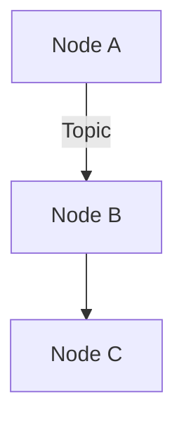

# Master Content Generation Spec
## Physical AI & Humanoid Robotics Textbook

---

## 📋 General Writing Guidelines (Apply to ALL Chapters)

### Target Audience
- Intermediate programmers with Python knowledge
- AI engineers transitioning to robotics
- University students (junior/senior level)
- Self-learners with technical background

### Writing Style
- **Tone:** Professional but approachable, encouraging
- **Voice:** Second person ("you will learn...")
- **Technical Level:** Intermediate - explain concepts clearly but don't oversimplify
- **Length:** 2000-3000 words per chapter (except project chapters: 3500-4000 words)

### Mandatory Structure for Each Chapter

```markdown
---
sidebar_position: [NUMBER]
---

# [Chapter Title with Emoji]

[Engaging introduction paragraph - explain why this topic matters]

## 🎯 Learning Objectives

By the end of this chapter, you will:
- [Objective 1]
- [Objective 2]
- [Objective 3]

## [Main Content Sections]

[3-5 major sections with technical content, examples, and explanations]

## 💡 Key Takeaways

- [Summary point 1]
- [Summary point 2]
- [Summary point 3]

## 🏋️ Hands-On Exercise

[Practical exercise for the student to try]

**Expected Time:** [X minutes]

**Requirements:**
- [Requirement 1]

**Instructions:**
1. [Step 1]
2. [Step 2]

**Solution Hints:**
[Provide guidance without giving away the full solution]

## 📚 Further Reading

- [Resource 1 with link]
- [Resource 2 with link]

---

**Next Chapter:** [Link to next chapter]
```

### Code Example Standards
- Use Python 3.10+ syntax
- Include type hints where appropriate
- Add comments explaining key concepts
- Show both minimal examples and production patterns
- Always test-able (even if conceptual)

### Formatting Requirements
- Use **bold** for key terms on first use
- Use `code formatting` for commands, file names, variables
- Use > blockquotes for important notes
- Use :::tip, :::warning, :::info admonitions
- Include mermaid diagrams where helpful
- Add emojis to section headers for visual appeal

---

## 📚 Module-Specific Requirements

### Module 1: ROS 2 - The Robotic Nervous System

**Key Concepts to Cover:**
- ROS 2 architecture and DDS middleware
- Nodes, topics, services, actions
- Quality of Service (QoS) policies
- Python rclpy library
- URDF robot descriptions
- Launch file systems
- Integration with AI agents

**Code Examples Must Include:**
- Publisher and subscriber nodes
- Service client and server
- Action client and server
- Custom message types
- Launch file examples
- URDF snippets

**Real-World Applications:**
- Autonomous navigation
- Sensor fusion
- Multi-robot coordination

---

### Module 2: Gazebo & Unity - Digital Twin

**Key Concepts to Cover:**
- Physics simulation principles
- SDF and URDF formats
- Sensor simulation (LiDAR, cameras, IMU)
- Unity for high-fidelity rendering
- World building and environments
- Sim-to-real considerations

**Code Examples Must Include:**
- Basic Gazebo world files
- Robot model definitions
- Sensor configurations
- Unity-ROS bridge setup

**Real-World Applications:**
- Safe robot testing
- Training data generation
- Algorithm validation

---

### Module 3: NVIDIA Isaac - AI-Robot Brain

**Key Concepts to Cover:**
- Isaac Sim and Omniverse
- Synthetic data generation
- Isaac ROS packages
- VSLAM and navigation
- Nav2 path planning
- Perception pipelines
- Reinforcement learning for robotics
- Sim-to-real transfer techniques

**Code Examples Must Include:**
- Isaac Sim scene setup
- Isaac ROS node configurations
- Nav2 configuration files
- Perception pipeline code

**Real-World Applications:**
- Warehouse automation
- Last-mile delivery
- Manufacturing robotics

---

### Module 4: Vision-Language-Action (VLA)

**Key Concepts to Cover:**
- Voice command processing with Whisper
- LLM integration for cognitive planning
- Natural language to robot actions
- Multimodal interaction
- GPT/Claude API integration
- End-to-end VLA pipelines

**Code Examples Must Include:**
- Whisper integration code
- LLM API calls
- Command parsing and execution
- Safety and validation layers

**Real-World Applications:**
- Home service robots
- Collaborative robots (cobots)
- Human-robot interaction

---

## 🎯 Content Generation Priority Order

### Phase 1: Core Learning Path (Generate First)
1. docs/intro.md ✅ (Already done)
2. docs/getting-started/overview.md
3. docs/getting-started/prerequisites.md
4. docs/module-1/introduction.md
5. docs/module-1/ros2-architecture.md
6. docs/module-1/nodes-and-topics.md

### Phase 2: Complete Modules
7. Finish all Module 1 chapters
8. Finish all Module 2 chapters
9. Finish all Module 3 chapters
10. Finish all Module 4 chapters

### Phase 3: Supporting Content
11. All Humanoid chapters
12. All Capstone chapters
13. All Appendix chapters

---

## 🤖 Prompts for Claude CLI

### Generate Single Chapter
```
Read specs/master-content-generation.md for context.

Generate content for: docs/[path]/[filename].md

Follow all guidelines in the spec. This is a chapter about [TOPIC].
Focus on [KEY POINTS].

Write the complete markdown content and save it to the file.
```

### Generate Entire Module
```
Read specs/master-content-generation.md for context.

Generate all chapters for Module [X]:
- docs/module-X/introduction.md
- docs/module-X/[chapter2].md
- docs/module-X/[chapter3].md
[... list all chapters]

Generate them one by one, following all guidelines.
Start with the introduction.
```

### Review and Improve
```
Read docs/[path]/[filename].md

Review this chapter for:
1. Technical accuracy
2. Completeness (2000-3000 words)
3. Code example quality
4. Structure adherence

Suggest improvements or rewrite if needed.
```

---

## 📊 Quality Checklist (Use After Generation)

For each chapter, verify:
- [ ] 2000-3000 words (or 3500-4000 for projects)
- [ ] Has learning objectives section
- [ ] Has key takeaways section
- [ ] Has hands-on exercise
- [ ] Has further reading links
- [ ] Includes 3-5 code examples
- [ ] Uses proper markdown formatting
- [ ] Has emojis in headers
- [ ] Links to next chapter
- [ ] Technically accurate
- [ ] Engaging and motivating

---

## 🎓 Assessment Components

### Knowledge Checks (Add to Each Chapter)
Create 3-5 multiple choice or short answer questions that test:
- Conceptual understanding
- Practical application
- Problem-solving

### Hands-On Exercises
Each exercise should:
- Take 15-30 minutes
- Reinforce chapter concepts
- Build toward module project
- Provide starter code when appropriate

### Module Projects
Each module ends with a project that:
- Integrates all chapter concepts
- Takes 4-8 hours to complete
- Has clear rubric and deliverables
- Provides complete solution code

---

## 🔗 Cross-Linking Strategy

- Link to previous chapters when referencing concepts
- Link to next chapters to maintain flow
- Link to appendix for deep dives
- Link to external resources (official docs, papers)

Example:
```markdown
As we learned in [ROS 2 Architecture](/module-1/ros2-architecture), 
nodes communicate through topics...
```

---

## 📝 Special Content Types

### Diagrams (Use Mermaid)
```markdown

```

### Admonitions
```markdown
:::tip Pro Tip
Always source your ROS 2 workspace before running commands!
:::

:::warning Common Mistake
Don't forget to rebuild after changing message definitions.
:::

:::info Did You Know?
ROS 2 supports real-time systems with DDS!
:::
```

### Code Blocks with Highlights
```python
import rclpy
from rclpy.node import Node

class MyNode(Node):
    def __init__(self):
        super().__init__('my_node')  # highlight-line
        self.get_logger().info('Node started!')
```

---

## 🎯 Success Metrics

Content is successful if a student can:
1. Understand the concept from reading alone
2. Complete the exercise without external help
3. Apply knowledge to the module project
4. Explain the concept to someone else

---

## 🚀 Ready to Generate!

Use this spec as the foundation for all content generation.
Each chapter should feel cohesive while maintaining its unique focus.